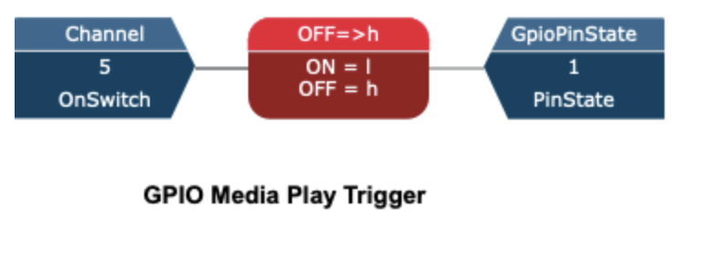

## Telos Axia Local Play/Pause Utility

### Problem:
As a DJ at [WRBB](https://wrbbradio.org), I like to use both hands on the broadcast console to seamlessly fade out of microphones and into my music. If both hands are on the console, that leaves no hands to reach over and press play on my laptop. This is normally solved in professional facilities by using virtual GPIO that interacts with the automation software, so when the DJ presses the channel "on" button, the music starts.

### Solution:
This is a similar software GPIO implementation using the Pathfinder Core Pro software. I've created a simple flow that sets a GPI pin based on if the channel playing out the laptop audio is on. This can be seen below.

The python script creates a connection to the virtual GPIO port that pathfinder has. This uses the Livewire GPIO standard which is a simple telnet service ([read more here](https://www.mediarealm.com.au/articles/debugging-livewire-gpio-telnet/)). Then we listen for any changes on the port and trigger the play/pause key on the computer.

### Drawbacks:
This is far from a polished solution. It only works on Mac (because it uses the Quartz library), it does not understand if you're already playing music or if the console already has the channel on. It also uses the telnet library which is soon to be deprecated in Python 3.13.
